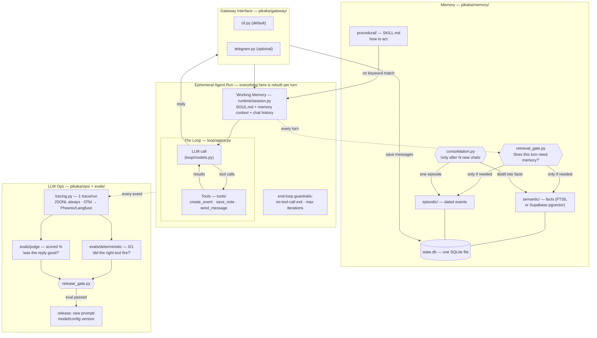

# Architecture — the whiteboard, refreshed

The same system as the two whiteboard diagrams from the previous videos
(the generic Harness/Loop/Memory/LLM-Ops one and the Hermes-specific one),
now with a file path on every box.

## Design decisions worth stealing

- **The gate before retrieval** (not retrieval on every turn): a cheap-model judge
  answers "does this message need the user's memory?" — saves latency and, more
  importantly, keeps irrelevant memories from biasing answers.
- **Consolidation is batched** ("after N chats"), asynchronous to the reply path,
  and loss-safe: if the summarizer fails, the chat log stays unconsolidated.
- **Deterministic evals and judge evals never mix.** One is a unit test, the other
  is a scored opinion. The release gate requires 100% of the first and a threshold
  on the second.
- **Every layer has a boring default and a documented upgrade** — FTS5 → pgvector,
  mock calendar → Google Calendar, JSONL → Phoenix/Langfuse. The default is always
  zero-signup.
- **Graphs wrap the loop, never replace it.** When a turn needs shape (parallel
  steps, explicit routing), an opt-in graph workflow (`pikaka/graph/`) arranges nodes
  around the untouched loop — the `full_agent` node IS `run_loop`. Routers are plain
  code reading state a model wrote; every failure fails open to the plain loop; the
  dashboard renders the topology from the engine's own `describe()` so the picture
  can't drift. See `docs/agent-graphs-design.md`.

## What this deliberately is not

Not a framework, not multi-agent, not production. (Still not multi-agent even with
graph workflows: a graph's `agent_node` is the same loop invoked as one step — no
peer-to-peer agent messaging, execution follows the edges deterministically.) It's
the readable blueprint — OpenClaw and Hermes are the products; this is the afternoon
read that explains them.
