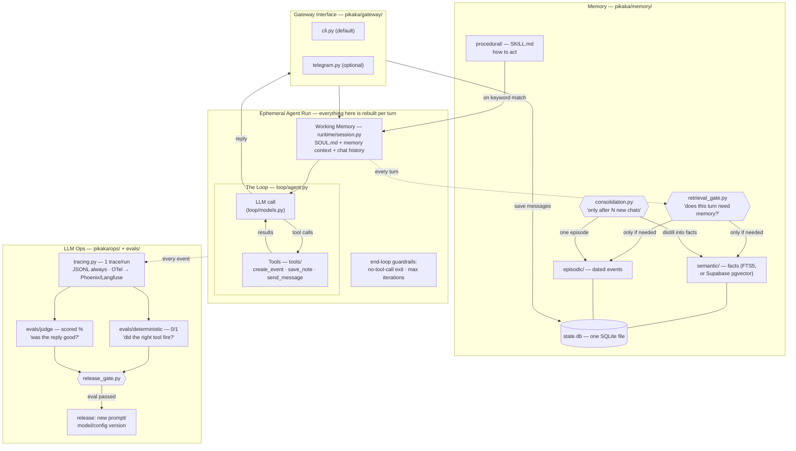

# 架构 —— 白板，刷新版

> 本文是 [`architecture.md`](architecture.md) 的中文翻译。以英文原稿为准；如有出入，以原文为准。

和前几个视频里那两张白板图是同一个系统（通用的 Harness/Loop/Memory/LLM-Ops 那张，和
Hermes 专用那张），现在每个框都带上了文件路径。

> 图中保留英文标签，是为了和白板图及代码里的命名一一对应。

## 值得借鉴的设计决策

- **检索前置一个关卡**（而不是每轮都检索）：用一个便宜模型的裁判回答「这条消息需要
  用户的记忆吗？」——省延迟，更重要的是，避免无关记忆带偏回答。
- **巩固是分批的**（「N 次聊天之后」），异步于回复路径，且不丢数据：如果摘要器失败，
  聊天日志保持未巩固状态。
- **确定性评估和裁判评估永不混用。** 一个是单元测试，另一个是打分意见。发布关卡要求
  前者 100% 通过，后者过阈值。
- **每一层都有一个无聊的默认值和一条记录在案的升级路径**——FTS5 → pgvector、mock
  日历 → Google Calendar、JSONL → Phoenix/Langfuse。默认值永远零注册。
- **图包裹循环，永不替代循环。** 当一轮需要形状（并行步骤、显式路由）时，一个 opt-in
  的图工作流（`pikaka/graph/`）在未改动的循环周围安排节点——`full_agent` 节点**就是**
  `run_loop`。路由器是读模型写下的状态的普通代码；任何失败都 fail-open 回退到普通循环；
  dashboard 从引擎自己的 `describe()` 渲染拓扑，所以图永远不会走样。见
  `docs/agent-graphs-design.md`。

## 这刻意不是什么

不是框架，不是多 agent，不是生产级。（即使有了图工作流，也仍然不是多 agent：图的
`agent_node` 是作为一步被调用的同一个循环——没有 agent 间的点对点消息，执行确定性
地沿着边走。）它是可读的蓝图——OpenClaw 和 Hermes 是产品；这是解释它们的、一个下午
就能读完的那篇文字。
